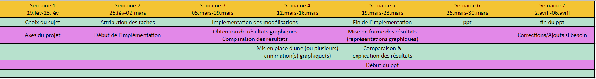

# Simulation d'un réseau de neurones biologiques après l'ajout de substances psychoactives

# Sommaire
- [Espace collaborateur](#collaborateurs)
- [Comptes rendus](#compte_rendu)
- [Planning des semaines](#agenda)
- [Membre du groupe de recherche](#membres)  
- [Attribution des taches](#taches)
- [Présentation sommaire du sujet](#sujet)
- [Modélisations mathématiques](#doc_ref)  
- [Modélisation d'un réseau biologique](#Modélisations)
  - [Une première modélisation (simplifiée)](#modélisation_simplifiee)
  - [Prise en compte de la décroissace du potentiel](#Modélisation_décroissance_potentiel)
  - [Prise en compte de l'efficacité des connexions neuronales](#Modélisation_efficacite_connexions)
  - [Prise en compte de la plasticité synaptique](#Modélisation_plasticité)
    - [Plasticité à court terme](#Modélisation_plasticité_court_terme)
    - [Plasticité à long terme](#Modélisation_plasticité_long_terme)

<a name="membres"/>

# Membre du groupe de recherche :
- L'HARIDON Nora
- WEBER Benajmin
- CAO Song Toan 
- PINTO VIDEIRA Michael

<a name="taches"/>

# Attribution des taches :
- CAO Song Toan : Modélisation section 0.7
- PINTO VIDEIRA Michael : Modélisation section 0.8-0.9-0.10
- WEBER Benajmin : Modélisation 0.11.1
- L'HARIDON Nora : Modélisation 0.11.2

Se référer au document [Modélisation mathématique](/reseau-neuronal-biologique-theorie.pdf) ou au document Latex : https://www.overleaf.com/read/wfvbnzmmkvtf pour les sections

<a name="agenda"/>

# Planning des semaines

<a name="sujet"/>

# Présentation du sujet :

Un neurone est une unité fonctionnelle réalisant une sommation spatiale et temporelle de ses entrées (les dendrites) à tout instant. Si le résultat (alors sous la forme d'un potentiel électrique) est supérieur à un certain seuil, le neurone envoie un influx nerveux, aussi dit potentiel d'action, via son axone. Les synapses permettent alors la conversion de ce signal électrique en un signal chimique perceptible par les autres neurones qui y sont connectés. 

<a name="doc_ref"/>

# Modélisations mathématiques :
- Pour voir __notre modélisation mathématique__ dans son ensemble voir le docuement : [Modélisation mathématique](/reseau-neuronal-biologique-theorie.pdf) ou utiliser le lien vers le document latex : https://www.overleaf.com/read/wfvbnzmmkvtf
- Pour voir __nos travaux de recherches préalables__ (travaux de découverte du sujet) s'orienter vers le document : [Préambule des recherches](/Annexes/Documents/recherche_reseau_neurone.pdf)

<a name="Modélisations"/>

# Modélisations d'un réseau neuronal biologique

Pour les détails et explications de ces modélisations se référer au document [Modélisation mathématique](/reseau-neuronal-biologique-theorie.pdf) ou au document Latex : https://www.overleaf.com/read/wfvbnzmmkvtf

<a name="modélisation_simplifiee"/>

## Première modélisation :

Nous traduisons cette formule sous forme matricielle afin de simplifier les calculs par la suite :

<a name="Modélisation_décroissance_potentiel"/>

## Deuxième Modélisation :
Dans cette modélisation, on prend en compte le temps de décroissance du potentiel après une dépolarisation du neurone considéré

<a name="Modélisation_efficacite_connexions"/>

## Troisième Modélisation :
Cette modélisation prend en compte l'efficacité des connexions entre neurone. Les seuls éléments à modifier par rapport à la modélisation précédente sont : 

<a name="Modélisation_plasticité"/>

## Quatrième Modélisation :
Cette modélisation prend en compte la plasticité synaptique

<a name="Modélisation_plasticité_court_terme"/>

### Plasticité à court terme :

<a name="Modélisation_plasticité_long_terme"/>

### Plasticité à long terme :

<a name="compte_rendu"/>

# Comptes rendus :

- [Semaine 1](/Annexes/Comptes_rendus/semaine_1.md)
- [Semaine 2](/Annexes/Comptes_rendus/semaine_2.md)

<a name="collaborateurs"/>

# Espace collaborateur

- Planning des semaines :
https://drive.google.com/open?id=1Vw6gvXTmE5HrGNWk1n0so6Bvhxphmd_pP5HaBENPydw
- Prototypage des fonctions :
https://docs.google.com/spreadsheets/d/1MQP3e_22xNJkt3NTb-GM5Ss8K3aWw2OJYi8oWpn6JbA/edit?usp=sharing

Document de référence des fonctions créent pour toutes les modélisations. Chaque fonction doit être présentée avec son nom, ses variables d'entrées et de sorties (noms, types et significations).
Un programme en Google App a été créé pour l'occasion afin de notifier automatiquement chaque utilisateur suivant une fonction ayant été modifié. 
Pour voir le fonctionnement du fichier voir le fichier [Mode d'emploi prototypage fonction](/Annexes/Documents/Mode_d'emploi_prototypage_fonction.md)
