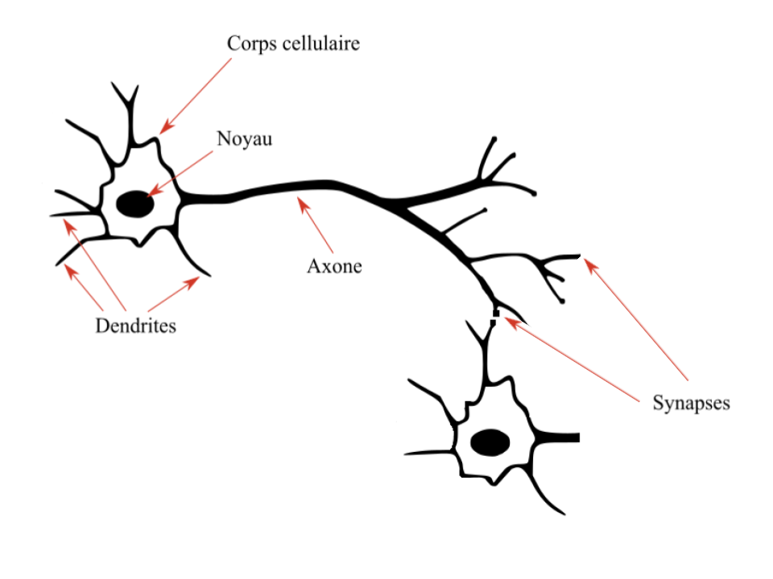
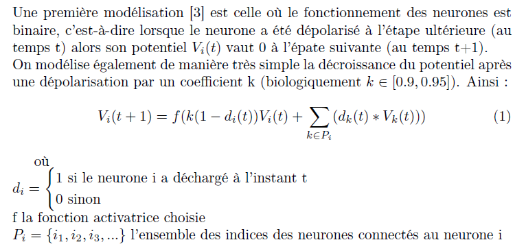
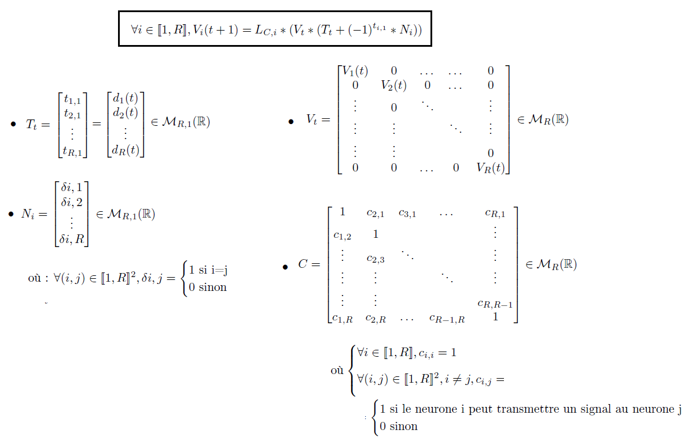
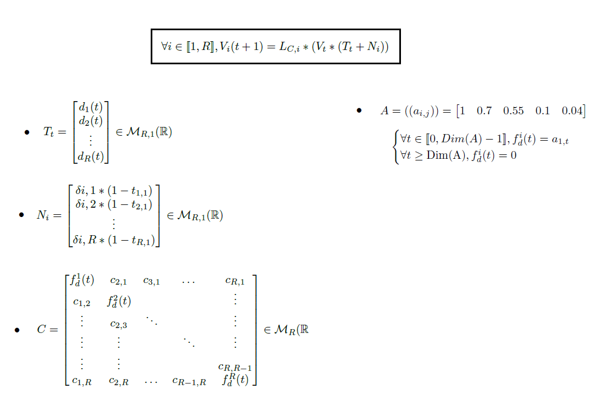
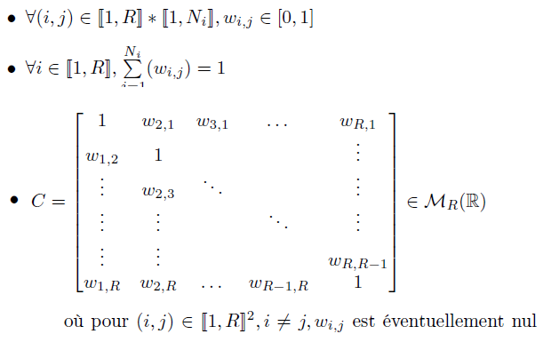
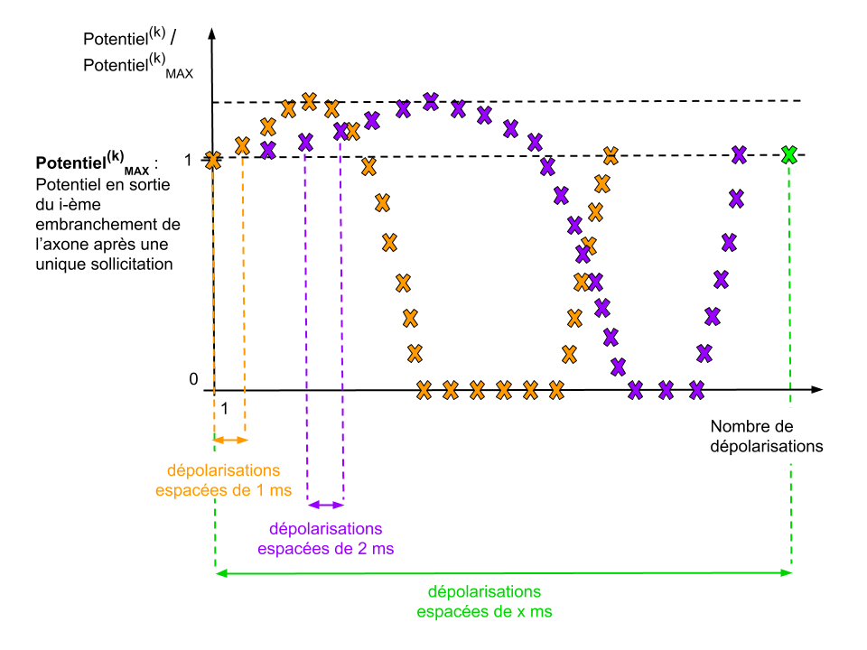

# Simulation d'un réseau de neurones biologique après l'ajout de substances psychoactives

# Sommaire
- [Membre du groupe de recherche](#membres)  
- [Modélisations mathématiques](#doc_ref)  
- [Présentation sommaire du sujet](#sujet)
- [Modélisation d'un réseau biologique](#Modélisations)
  - [Une première modélisation (simplifiée)](#modélisation_simplifiee)
  - [Prise en compte de la décroissace du potentiel](#Modélisation_décroissance_potentiel)
  - [Prise en compte de l'efficacité des connexions neuronales](#Modélisation_efficacite_connexions)
  - [Prise en compte de la plasticité synaptique](#Modélisation_plasticité)
    - [Plasticité à court terme](#Modélisation_plasticité_court_terme)
    - [Plasticité à long terme](#Modélisation_plasticité_long_terme)

<a name="membres"/>

# Membre du groupe de recherche :
- L'HARIDON Nora
- WEBER Benajmin
- CAO Song Toan 
- PINTO VIDEIRA Michael

<a name="sujet"/>

# Présentation du sujet :

Un neurone est une unité fonctionnelle réalisant une sommation spatiale et temporelle de ses entrées (les dendrites) à tout instant. Si le résultat (alors sous la forme d'un potentiel électrique) est supérieur à un certain seuil, le neurone envoie un influx nerveux, aussi dit potentiel d'action via son axone. Les synapses permettent alors la conversion de ce signal électrique en un signal chimique perceptible par les autres neurones qui y sont connectés. 

<a name="doc_ref"/>

# Modélisations mathématiques :
- Pour voir __notre modélisation mathématique__ dans son ensemble voir le docuement : [Modélisation mathématique](/Annexes/Documents/reseau-neuronal-biologique-theorie.pdf)
- Pour voir __nos travaux de recherches préalables__ (travaux de découverte du sujet) s'orienter vers le document : [Préambule des recherches](/Annexes/Documents/recherche_reseau_neurone.pdf)

<a name="Modélisations"/>

# Modélisations d'un réseau neuronal biologique

Pour les détails et explications de ces modélisations se référer à la section [Modélisations mathématiques](#doc_ref)  

<a name="modélisation_simplifiee"/>

## Première modélisation :

Nous traduisons cette formule sous forme matricielle afin de simplifier les calculs par la suite :

<a name="Modélisation_décroissance_potentiel"/>

## Deuxième Modélisation :
Dans cette modélisation, on prend en compte le temps de décroissance du potentiel après une dépolarisation du neurone considéré

<a name="Modélisation_efficacite_connexions"/>

## Troisième Modélisation :
Cette modélisation prend en compte l'efficacité des connexions entre neurone. Les seuls éléments à modifier par rapport à la modélisation précédente sont : 

<a name="Modélisation_plasticité"/>

## Quatrième Modélisation :
Cette modélisation prend en compte la plasticité synaptique

<a name="Modélisation_plasticité_court_terme"/>

### Plasticité à court terme :

<a name="Modélisation_plasticité_long_terme"/>

### Plasticité à long terme :
