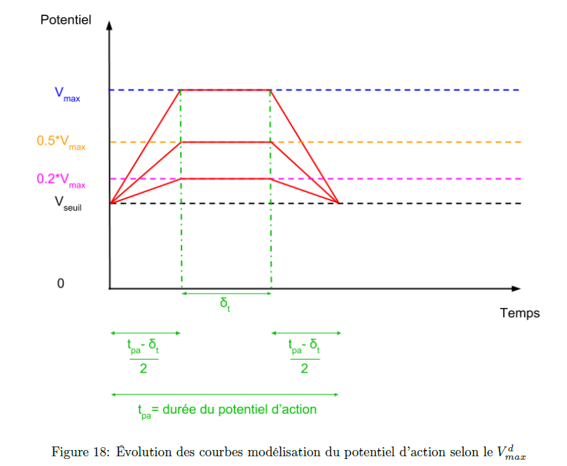

# Simulation d'un réseau de neurones biologiques après l'ajout de substances psychoactives

# Sommaire
- [Espace collaborateur](#collaborateurs)
- [Comptes rendus](#compte_rendu)
- [Planning des semaines](#agenda)
- [Membre du groupe de recherche](#membres)  
- [Attribution des taches](#taches)
- [Modélisation d'un réseau biologique](#Modélisations)
  - [Présentation sommaire du sujet](#sujet)
  - [Une première modélisation (simplifiée)](#modélisation_simplifiee)
  - [Prise en compte de la décroissace du potentiel](#Modélisation_2)
  - [Prise en compte de l'efficacité des connexions neuronales](#Modélisation_3)
- [Modélisations mathématiques](#doc_ref) 

<a name="membres"/>

# Membre du groupe de recherche :
- L'HARIDON Nora
- WEBER Benajmin
- CAO Song Toan 
- PINTO VIDEIRA Michael

<a name="taches"/>

# Attribution des taches :
- CAO Song Toan : Modélisation section 0.7
- PINTO VIDEIRA Michael : Modélisation section 0.8-0.9-0.10
- WEBER Benajmin : Modélisation 0.11.1
- L'HARIDON Nora : Modélisation 0.11.2

Se référer au document [Modélisation mathématique](/reseau-neuronal-biologique-theorie.pdf) ou au document Latex : https://www.overleaf.com/read/wfvbnzmmkvtf pour les sections

<a name="agenda"/>

# Planning des semaines

voir le document origial [ici](https://docs.google.com/spreadsheets/d/1Vw6gvXTmE5HrGNWk1n0so6Bvhxphmd_pP5HaBENPydw/edit?usp=sharing)

<a name="sujet"/>

# Présentation du sujet :

Un neurone est une unité fonctionnelle réalisant une sommation spatiale et temporelle de ses entrées (les dendrites) à tout instant. Si le résultat (alors sous la forme d'un potentiel électrique) est supérieur à un certain seuil, le neurone envoie un influx nerveux, aussi dit potentiel d'action, via son axone. Les synapses permettent alors la conversion de ce signal électrique en un signal chimique perceptible par les autres neurones qui y sont connectés. 

_Notre but est de simuler le fonctionnement d'un reseau de neurone biologique afin d'observer son comportement au repos et lorsque des substances psychoactives interfèrent avec lui._

<a name="modélisation_simplifiee"/>

## Première modélisation :

Une première modélisation consiste à prendre en compte l'activité d'un neurone qu'une fois que celui ci s'est dépolarisé (le pas de temps étant alors cette période pendant laquelle le potentiel d'action existe). 

Le principe sous jacent à cette formule est simplement de cumuler le potentiel du neurone (s'il ne s'est pas dépolarisé juste avant) avec tous les potentiels à ses entrées (donc prendre en compte tous les neurones lié à celui-ci et s'étant dépolarisé à l'étape précédente). 
Rappelons qu'un neurone transmet un potentiel uniquement lorsque celui-ci se dépolarise (pour simplifier).

Pour adapter ce calcul à une forme matricielle (plus simple à implémenter), on définit la matrice suivante :

Chaque coefficient de cette matrice permet de connaitre l'état des R neurones du réseau à l'étape précédente (1 si le neurone s'est dépolarisé, 0 sinon).

On pose ensuite la matrice suivante :

Cette matrice permet de sauvegarder les valeurs des potentiels, des R neurones acquis, à l'étape précédente. 

Pour finir, on pose la matrice définissant les relations entre chaque neurone (le coefficient d'indice (i,j) vaut 1 lorsque le neurone i peut transmettre au neurone j). 

On constate que pour tout i, le coefficient d'indice (i,i) vaut 1; ce qui signifie que le neurone i peut se transmettre un message. Cela n'a aucune lien avec le cas biologique mais permet d'alleger le calcul matriciel. 

On réalise alors le calcul matriciel suivant afin de connaitre le potentiel d'un neurone à l'étape suivante :

Pour cette première modélisation, on choisit une fonction activatrice seuil :

<a name="modélisation_2"/>

## Deuxième Modélisation :

La dernière modélisation ne prennait pas en compte un phénomène essentiel dans le cas biologique : les ramifications de l'axone. En fait, le courant traverssant l'axone est sensiblement le même le long de tout l'axone. Mais, l'axone se divise en de nombreux embranchements qui seront reliés à d'autres neurones; et la qualité des connections n'est pas la même. Autrement dit, chaque neurone relié en reception à un même autre neurone ne recoit pas le même potentiel à une de ses entrées. 
On peut résumer ce phénomène sur la graphique ci-dessous 
:

On modifie alors la matrice C de la manière suivante :

<a name="modélisation_3"/>

## Dernière modélisation :

La première modélisation a également un autre défaut : son pas de temps. En effet, son pas de temps est celui du temps refactaire du neurone (temps pendant lequel le neurone ne peut pas être de nouveau dépolariser après s'être dépolariser une première fois). En fait, pendant cet interval de temps, le potentiel du neurone décroit quasiment jusqu'a sa valeur au repos. Alors, prendre un pas de temps aussi grand, c'est restreindre l'effet de la sommation temporelle que réalise les neurones biologiques (comme le montre la figure ci-dessous).

Ainsi, nous devons réduire notre pas de temps (de l'ordre de 0.1 milliseconde). Réduire le pas de temps à un pas de temps plus petit que la période réfarctaire signifie que nous devons désormais modéliser l'evoltuion du potentiel d'un neurone pendant la phase de dépolarisation. 
En effet, la transmission du potentiel d'action ne se réduit pas à la phase de dépolarisation, comme le montre la figure ci-dessous :

Ainsi, nous devons modéliser cette évolution de la valeur du potetiel d'action au cours de la dépolarisation et de la repolarisation (potentiel alors percu par les autres neurones). Ainsi, le neurone n'est plus visible qu'a une seule étape comme cela était le cas dans la première modélisation. 

On modélise les phases de dépolarisation et de repolarisation par des fonctions affines comme ci-dessous :

Notons également qu'a chaque nouvelle dépolarisation, le potentiel maximla atteint diminue pourvu que ces dépolarisation aient lieu en un court lapse de temps. Puis au fil du temps (en abscence de dépolarisation) le potentiel maximal atteint de nouveau sa valeur de départ; comme le montre la figure ci-dessous :

Il nous reste encore un dernier phénomène à prendre en compte : l'évolution du potentiel hors dépolarisation. En fait, si le potentiel globale du neurone est positif, alors ce potentile va décroite de manière exponetielle (pour une raison biologioque ayant un rapport avec le nombre d'ions évacues au cours du temps, qui est plus important lorsque le potentiel est grand). Et lorsque le potentiel globale est négatif (pour notre modélisation où l'on considère que le potentiel de repos est nul), il remonte de manière exponentielle vers 0. 

On modélise donc ces deux phases par des fonction exponentielle :

<a name="doc_ref"/>

# Modélisations mathématiques :
- Pour voir __notre modélisation mathématique__ dans son ensemble voir le docuement : [Modélisation mathématique](/reseau-neuronal-biologique-theorie.pdf) ou utiliser le lien vers le document latex : https://www.overleaf.com/read/wfvbnzmmkvtf
- Pour voir __nos travaux de recherches préalables__ (travaux de découverte du sujet) s'orienter vers le document : [Préambule des recherches](/Annexes/Documents/recherche_reseau_neurone.pdf)

<a name="Modélisations"/>

# Modélisations d'un réseau neuronal biologique

Pour les détails et explications de ces modélisations se référer au document [Modélisation mathématique](/reseau-neuronal-biologique-theorie.pdf) ou au document Latex : https://www.overleaf.com/read/wfvbnzmmkvtf

<a name="modélisation_simplifiee"/>

## Première modélisation :

Nous traduisons cette formule sous forme matricielle afin de simplifier les calculs par la suite :

<a name="Modélisation_décroissance_potentiel"/>

## Deuxième Modélisation :
Dans cette modélisation, on prend en compte le temps de décroissance du potentiel après une dépolarisation du neurone considéré

<a name="Modélisation_efficacite_connexions"/>

## Troisième Modélisation :
Cette modélisation prend en compte l'efficacité des connexions entre neurone. Les seuls éléments à modifier par rapport à la modélisation précédente sont : 

<a name="Modélisation_plasticité"/>

## Quatrième Modélisation :
Cette modélisation prend en compte la plasticité synaptique

<a name="Modélisation_plasticité_court_terme"/>

### Plasticité à court terme :

<a name="compte_rendu"/>

# Comptes rendus :

- [Semaine 1](/Annexes/Comptes_rendus/semaine_1.md)
- [Semaine 2](/Annexes/Comptes_rendus/semaine_2.md)

<a name="collaborateurs"/>

# Espace collaborateur

- Planning des semaines :
https://drive.google.com/open?id=1Vw6gvXTmE5HrGNWk1n0so6Bvhxphmd_pP5HaBENPydw
- Prototypage des fonctions :
https://docs.google.com/spreadsheets/d/1MQP3e_22xNJkt3NTb-GM5Ss8K3aWw2OJYi8oWpn6JbA/edit?usp=sharing

Document de référence des fonctions créent pour toutes les modélisations. Chaque fonction doit être présentée avec son nom, ses variables d'entrées et de sorties (noms, types et significations).
Un programme en Google App a été créé pour l'occasion afin de notifier automatiquement chaque utilisateur suivant une fonction ayant été modifié. 
Pour voir le fonctionnement du fichier voir le fichier [Mode d'emploi prototypage fonction](/Annexes/Documents/Mode_d'emploi_prototypage_fonction.md)
